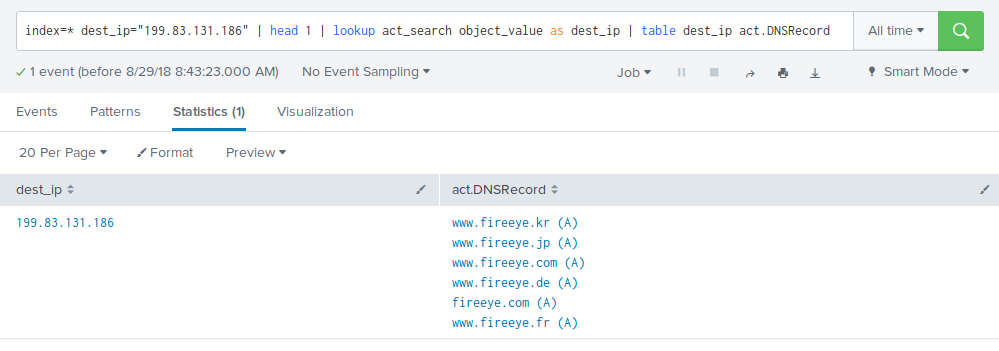

# act-splunk

act-splunk is a Splunk App that adds workflow actions and external lookups towards the [ACT platform](https://github.com/mnemonic-no/act-platform).

# Installation

* Download the app from spunkbase

or

* clone repository and build

```
./build.sh
```

# Setup

After installation, enter app > act > Set up to enter information on API and WWW hostname to connect to a running ACT instance.


# Features

## Workflow actions

Within search result, you will find workflow actions on supported field. When clicking on a workflow action, you will be redirected to the ACT GUI.


## External lookup towards act

When searching, you can use the `fact_search` external lookup to lookup facts related to a field.



