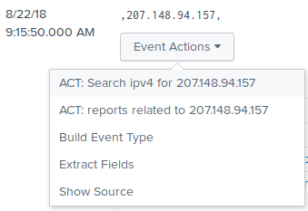
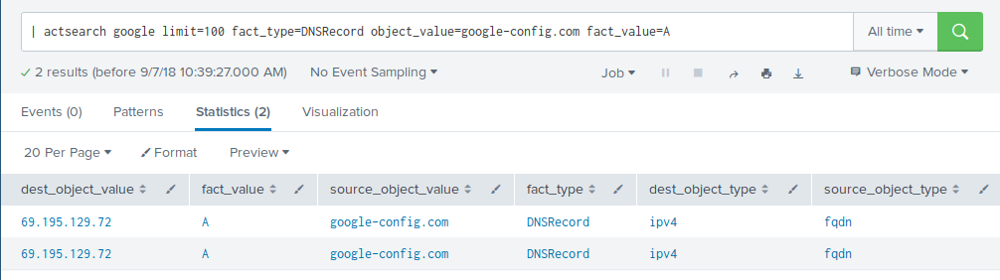

# act-splunk

act-splunk is a Splunk App that adds workflow actions and external lookups towards the [ACT platform](https://github.com/mnemonic-no/act-platform).

# Installation

* Download the app from spunkbase

or

* clone repository and build

```
./build.sh
```

# Setup

After installation, enter app > act > Set up to enter information on API and WWW hostname to connect to a running ACT instance.


# Features

## Workflow actions

Within search result, you will find workflow actions on supported field. When clicking on a workflow action, you will be redirected to the ACT GUI.



## ACT Search

You can specify a generic search using the `actsearch` command, to generate events based on an ACT query:

```
| actsearch [<keyword>] [option=value] [option=value]
```


The follwoing options can be specified, using `option=value` to limit the search result.

* limit (default=25)
* fact_type
* fact_value
* object_type
* object_value




```
```

## ACT annotation

You can use the `actadd` command to annotate existing events with data from an ACT query:

```
.... | actadd field1 [... fieldN] [option=value] [option=value]
```


Fields specified will be used as object_value in the search and the search result can be limited by the same options specified in the ACT Search.

`actsearch` and `actadd` can also be combined to annotate results from the search:


